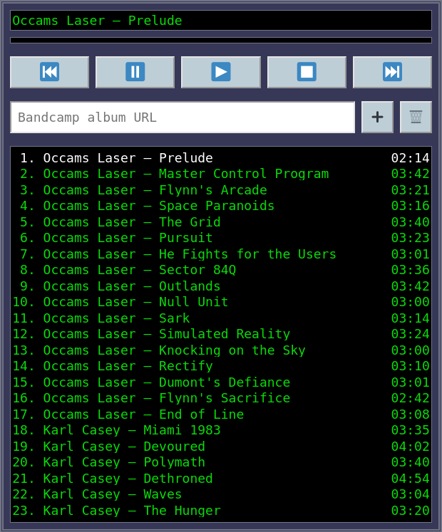

# [BC Player](https://torunar.github.io/bc-player/)

Bandcamp music player with a queue.

## Bandcamp integraiton

I also made a Firefox extension that adds "Enqueue in BC Player" context menu action so you can add albums to your listening queue directly from the Bandcamp feed page.

You can download the extension here: [bc-player-helper.xpi](https://github.com/torunar/bc-player-helper/releases/download/latest/bc-player-helper.xpi).

## Reasoning behind the project

Bandcamp doesn't let you play multiple albums in a queue.
I didn't like it, so I fixed the problem the only way I know: with some good ol' HTML, CSS and JS.

## Contributing

I see this project as feature-complete. I will mostly focus on fixing bugs, but might add a thing or two occasionally.

If you are willing to contribute to the project, be my guest! Make forks, implement features, make pull requests.
