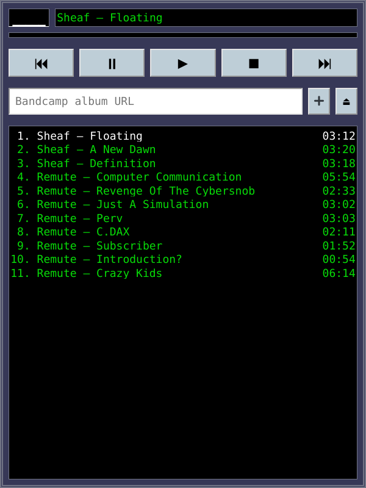

# [BandAmp 2.9](https://bandamp.fly.dev/)

Bandcamp music player with a queue.

## Bandcamp integraiton

I also made a Firefox extension that adds "Enqueue in Bandamp" context menu action so you can add albums to your listening queue directly from the Bandcamp feed page:

[context-menu-integration.webm](https://github.com/torunar/bandamp-2.9/assets/1062217/08d875f8-1cf6-44c9-a8c5-00498009ef6a)

You can download the extension here: [bandamp-2.9-helper.xpi](https://github.com/torunar/bandamp-2.9-helper/releases/download/v2.9/bandamp-2.9-helper.xpi).

## Reasoning behind the project

Bandcamp doesn't let you play multiple albums in a queue.
I didn't like it, so I fixed the problem the only way I know: with some good ol' PHP, HTML, CSS and JS.

## Contributing

I see this project as feature-complete. I will mostly focus on fixing bugs, but might add a thing or two occasionally.

If you are willing to contribute to the project, be my guest! Make forks, implement features, make pull requests.
